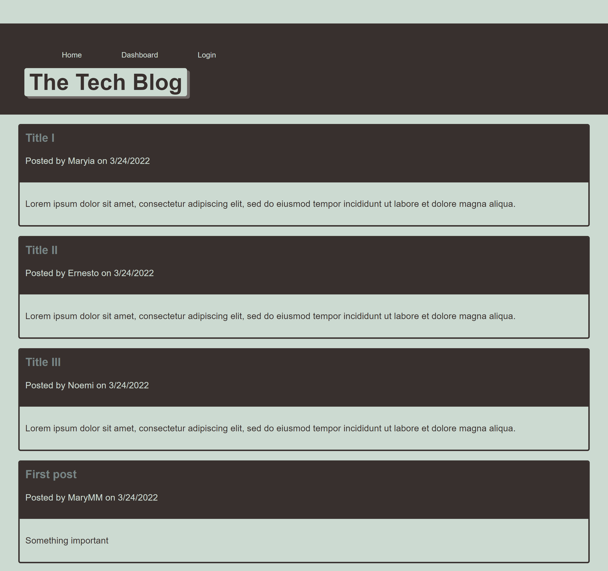

# Tech Blog

   
   ## malakhavam
   
   ## Description 
   
   CMS-style blog site similar to a Wordpress site, where developers can publish their blog posts and comment on other developers’ posts as well.

   ## Link to deployed application

   
   
   ## Table of Contents  
   * [Installation](#installation)
   * [Usage](#usage)
   * [Contributors](#contibutors)
   * [License](#license)
   * [Screenshot](#Srceenshot)
   * [Questions](#questions)
   
   
   ## Installation
   
   The project's GitHub repository: https://github.com/malakhavam/tech-blog     
   To install the project follow these steps: 
   * Clone the application from GitHub with: git clone [clone link from GitHub] 
   * From the root folder, install the dependencies with: npm install
   * Install MySQL2 with: npm install mysql2
   * Install Sequalize with: npm install sequelize
   * Install Dotenv with: npm install dotenv
   * Install Bcrypt with: npm install bccrypt
   * Install Express-handlebars with: npm i express-handlebars
   * Install express-session with: npm i express-session
   * Install connect-session-sequelize: npm i connect-session-sequelize 
   * Run the app with: npm start;

   ## Usage

   * In order to use and test the application, ensure that MySQL is installed in your environment.
   * Then, from the project root folder enter MySQL shell and run the following command:
        source db/schema.sql
   * Then run command:
        USE tech_blog;     
   * Exit Mysql shell and return to the command line still within your root project folder.
   * Run the following commands:
        npm run seed
        npm start

   ## Contributors

   N/A

   ## License

   MIT
  
   ## Screenshot

   
   
   ## Questions
   
   If you have questions or want to share comments, I will be glad to hear from you. Please contact me at malakhava@yahoo.com

   https://github.com/malakhavam/tech-blog
   
   malakhava@yahoo.com